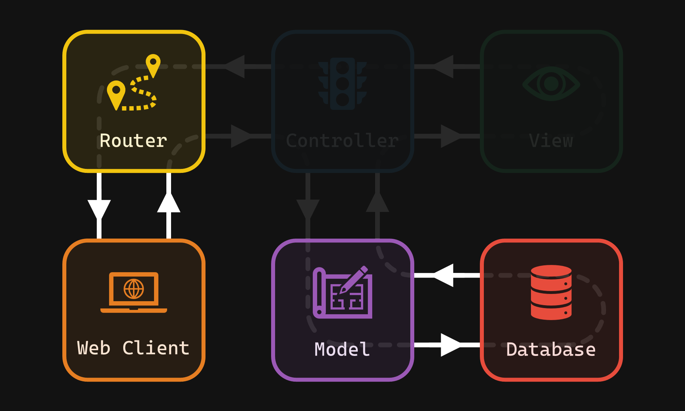
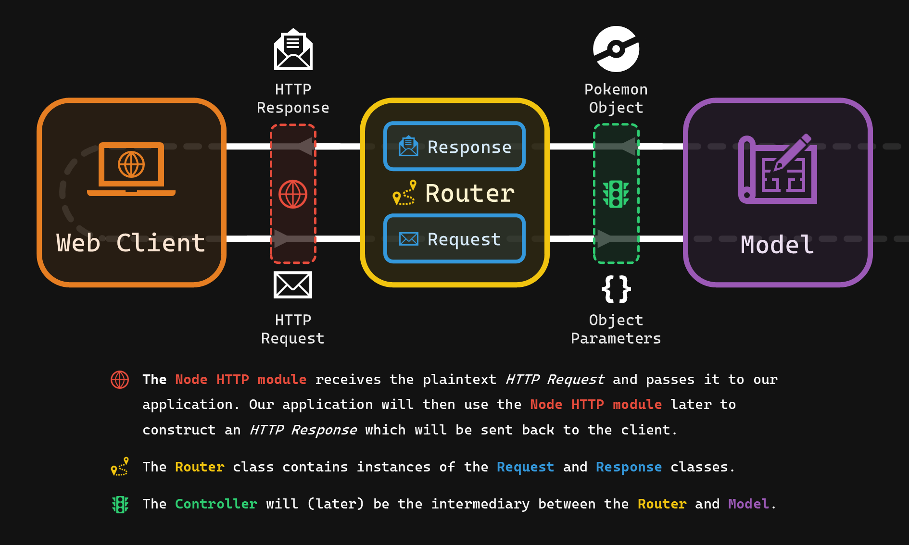

# Exercise 2.2 - Routing 🗺️

## 🎯 Objectives

- **Encapsulate** HTTP request/response functionality inside `Request` and `Response` classes.
- **Invoke** methods on the `Model` using the `Router` based on the data from the `Request`.
- **Construct** a `Response` based on the result from the `Model`.
- **Return** the requested data from the `Model` to the client.

## 🔨 Setup

1. Navigate to `~/web-ii/Exercises`.
2. Clone the Git repo `git clone <paste URL from GitHub>` (without the angle brackets).
3. You should now have a folder inside `Exercises` called `exercise-2_2-githubusername`.
   - If you want, you can rename this folder `2.2-Routing` for consistency's sake! 😉
4. Copy over `Model.js` and `Pokemon.js` from E1.4 into `src/models`:

   ```text
   2.2-Routing
   ├── src
   │   ├── App.js
   │   ├── database
   │   │   ├── .env
   │   │   └── Database.js
   │   ├── models
   │   │   ├── Model.js <--- Copy over from E1.4
   │   │   └── Pokemon.js <--- Copy over from E1.4
   │   └── router
   │       ├── Request.js
   │       ├── Response.js
   │       └── Router.js
   └── tests
       ├── http.test.js
       ├── request.test.js
       ├── response.test.js
       └── router.test.js
   ```

## 🔍 Context

In E2.1, we learned about HTTP *requests* and *responses*. The HTTP request is responsible for telling the server exactly what the client wants. The HTTP response is responsible for delivering the information the client requested from the server. Now the question is, _"how can we connect the requests/responses to the models we've written to access the data in the database?"_ The answer is: using **routers** (and later, **controllers**)!



In this exercise, we're going to build a `Router` class that will be responsible for:

1. Managing a `Request` object. This `Request` object will contain parsed information from the incoming HTTP request.
2. Managing a `Response` object. This `Response` object will contain the data to be sent in the outgoing HTTP response.



> 💡 Make the distinction in your mind between an **HTTP request**, which is simply plain text, and the **JS `Request` class**, which is the class that will hold the request data for us so that we may reference it throughout pur application. The same goes for an **HTTP response** and the **JS `Response` class**.

### 🗄️ Server.js & App.js

The entry point of the application is `server.js` - all HTTP requests come through here. When an HTTP request is received, `server.js` instantiates a `new App()` object. `App.js` is responsible for:

1. Instantiating new `Request`, `Response`, and `Router` objects
2. Parsing the HTTP request body for any incoming data
3. Sending the HTTP response back to the Client

You don't have to write anything in these files as everything should work out of the box. It's always a good idea to stick a breakpoint at the beginning of these files and step through to see how a request is handled.

### ⏯ Workflow

There are many moving pieces in our development environment - we have to keep track of our database, the test suite, and now a web server! To try and keep everything working smoothly, here's a suggested workflow:

1. Open a terminal inside this exercise directory and run `npm run server`. This will start `server.js` using the [nodemon](https://www.npmjs.com/package/nodemon) NPM module.
   - Without this module, you would have to manually restart the server every time you made a change to your application code.
   - With this module, all you have to do is start it once, and as soon as you save any source file, it will automatically restart the server!
   - You only need to have the server running when working on `http.test.js` since that's that only file that makes actual HTTP requests.
2. Open a JavaScript debug terminal inside this exercise directory. Use this terminal to run the test suites. Remember that you can do so by running `npm run test -- testSuiteName.test.js` or `npm run testWatch`, whichever one you're comfortable with.
3. Open a terminal and run `mysql`. Use this terminal to interface with the database. If you're using the GUI, then you can skip this step.
4. Open the first test file (`request.test.js`) and stick a `.only` on the first test. Work on that test until it passes, then move the `.only` to the next test.

### 🧪 Tests

Tests have been provided to help you construct the 3 new classes we will need. **Please complete the tests in this order:**

1. `request.test.js`: This suite will tell you what variables and functions/functionality the `Request` class should have. It will also test to see if your `Request` class parses the HTTP request data properly.
2. `response.test.js`: This suite will tell you what variables and functions/functionality the `Response` class should have. It will also test to see if your `Response` class organizes the HTTP response data properly.
3. `router.test.js`: This suite will tell you what variables and functions/functionality the `Router` class should have. It will also test to see if your `Router` class calls the right methods on the right models.
4. `http.test.js`: This suite will be the web client and send real HTTP requests to your application, and receive real HTTP responses back.

You'll notice that the first three test suites use the JS `Reflect` class. This class allows us to "inspect" 🕵️‍♀️ the content and behaviour of other classes. We will use it to ensure that your classes have the correct variables and functions. You can read more about what `Reflect` can do [here](https://developer.mozilla.org/en-US/docs/Web/JavaScript/Reference/Global_Objects/Reflect)!

## 🚦 Let's Go

The models and database have been provided, so you don't have to worry about those. Your job is to write three classes (`Request`, `Response`, and `Router`) that will handle the following requests:

| Request Method | Path            | Model   | Action               |
| -------------- | --------------- | ------- | -------------------- |
| `GET`          | `/`             |         |                      |
| `GET`          | `/pokemon`      | Pokemon | `findAll()` ⭐        |
| `GET`          | `/pokemon/{id}` | Pokemon | `findById(id)`       |
| `POST`         | `/pokemon`      | Pokemon | `create(name, type)` |
| `PUT`          | `/pokemon/{id}` | Pokemon | `save()`             |
| `DELETE`       | `/pokemon/{id}` | Pokemon | `delete()`           |
| `ANY`          | `/{garbage}`    |         |                      |

> ⭐ You will have to create the `findAll()` function inside `Pokemon.js`. It should be trivial to implement now that you're comfortable with talking to the MySQL database. Instead of returning a `new Pokemon` object, like in `findById()`, you will have to loop over the results and build an array of `new Pokemon` objects, then return the array.

To get a better understanding of what you're required to do, take a peek inside of `src/server.js` from E2.1. That singular file is taking care of:

1. **Parsing** the incoming HTTP request;
2. **Determining** which model to call;
3. **Invoking** the correct method (find/create/save/delete) based on the request's method and path;
4. **Returning** a response back to the client.

It's never a good idea in programming to have one file that does many things. To avoid this, we should split all of this functionality into their own separate classes. For this exercise we will be distributing the above logic into the `Request`/`Response`/`Router` classes.

### ✉️ Request

This class is responsible for parsing and organizing the HTTP request data.

- **Variables**
  - `string requestMethod`: The HTTP request method: `GET`, `POST`, `PUT`, or `DELETE`.
  - `string modelName`: The parsed model name from the request path. For example, the model for `/pokemon/1` would be `pokemon`. This value will later be used by the `Router` to invoke functions on the model.
  - `object parameters`: An **object** with two properties:
    - `body`: An **object** that contains the key/value pairs from the **body** of the HTTP request.
    - `header`: An **array** that contains any "pieces" of the path after the model name. The only potential value that this array can have, for this exercise, is the `id`. For example, the value for `header` should be `['1']` or `[1]` if the path is `/pokemon/1`.

      > 💡 It may seem strange to hold the header values in an array if it will only ever be the `id`. The idea is to have this be flexible for any length of path we may get in the future. For example, we may later have the feature for Pokemon to have abilities. An HTTP request path for this might look like `/pokemon/1/ability/4` which would mean, "get the ability with ID 4 for the Pokemon with ID 1".

- **Functions**
  - `constructor`:
    - Initializes the `requestMethod`
    - Parses the `modelName` from the path
    - Takes the `headerParameters` and `bodyParameters` and parses them further to construct `this.parameters`
      > 💡 To parse the `modelName` and `parameters.header` values from the `path`, you can use the built-in JS [`split()`](https://developer.mozilla.org/en-US/docs/Web/JavaScript/Reference/Global_Objects/String/split) function and split on the `/` character.
  - `getRequestMethod`: Getter for `this.requestMethod`
  - `getModelName`: Getter for `this.modelName`
  - `getParameters`: Getter for `this.paramaters`

### 💌 Response

This class is responsible for getting the data ready to go back to the client.

- **Variables**
  - `number statusCode`: The HTTP status code that tells the client what occurred on the server.
  - `string message`: A user-friendly message to describe if the request was successful or not.
  - `object|array payload`: An object or array containing data for the HTTP response. This should be an empty object if something went wrong.
- **Functions**
  - `constructor`: Initializes the `statusCode`, `message`, and `payload`.
  - `getStatusCode`: Getter for `this.statusCode`
  - `getMessage`: Getter for `this.message`
  - `getPayload`: Getter for `this.payload`
  - `toString`: Returns a [JSON stringified object](https://developer.mozilla.org/en-US/docs/Web/JavaScript/Reference/Global_Objects/JSON/stringify) containing `this.message` and `this.payload`.

    > 💡 Remember that an HTTP request and HTTP response are simply text that are transferred between client and server. In order to send back data inside of the HTTP response body, that data must be represented as a string.

### 🗺️ Router

This class is responsible for invoking the appropriate method on the appropriate model based on the results of the parsed `Request`. Once the `message` and `payload` have been determined, it will return a `Response` object to be sent back to the client as an HTTP response.

- **Variables**
  - `Request request`: Contains parsed information from the incoming HTTP request.
  - `Response response`: Contains the data to be sent in the outgoing HTTP response.
- **Functions**
  - `constructor`: Initializes the `request` and `response`.
  - `dispatch`:
    - Determines which function on which model to call based on the model name and request method from the `this.request`. Returns
    - Calls `this.response.setResponse()` and passes in the status code, message, and payload based on the output of the invoked model function.
    - Returns `this.response`.

## 📥 Submission

Check that all tests are passing by removing all occurrences of `.only` and running the test suite for the final time. Once you've made your final `git push` to GitHub, here's what you have to do to submit:

1. Go to [Gradescope](https://www.gradescope.ca/courses/828) and click the link for this assignment.
2. Select the correct repository and branch from the dropdown menus.
3. Click _Upload_.
4. Wait for the autograder to finish grading your submission. Once it's done, you should see the final output of the test results as well as your grade on the top right.
